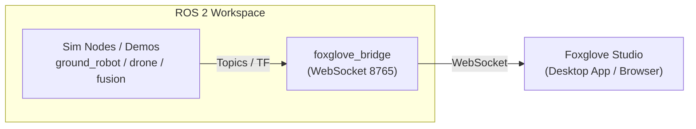

# Foxglove Studio 可視化ガイド

Foxglove Studio は、Web ブラウザまたはデスクトップアプリから ROS 2 の 3D シーン、TF、LiDAR スキャン、トピック、診断情報、プロットを統合して可視化できるモダンなツールです。

---

## 1. 接続方法の概要

Foxglove Studio と ROS 2 ワークスペースの接続には、**Foxglove WebSocket Bridge**（推奨）または **rosbridge** を使用します。



---

## 2. セットアップ手順

### 2.1 foxglove_bridge のインストール

Ubuntu / ROS 2 環境で bridge パッケージをインストールします：

```bash
sudo apt update
sudo apt install -y ros-${ROS_DISTRO}-foxglove-bridge
```

### 2.2 Bridge の起動

別ターミナルで bridge ノードを起動します（デフォルトポート: `8765`）：

```bash
source /opt/ros/${ROS_DISTRO}/setup.bash
ros2 run foxglove_bridge foxglove_bridge
```

### 2.3 サンプルデモの起動

可視化したいシミュレーションデモを起動します：

```bash
# 例: 地上ロボット（ウェイポイント追従 + 障害物回避）
ros2 launch ground_robot_sim waypoint_follower.launch.py

# または センサーフュージョン
ros2 launch sensor_fusion_sim sensor_fusion_demo.launch.py

# または ドローンミッション
ros2 launch drone_sim single_quad_waypoint.launch.py
```

### 2.4 Foxglove Studio で接続・レイアウト読み込み

1. [Foxglove Studio](https://foxglove.dev/) を開く（デスクトップアプリまたはブラウザ版 `https://studio.foxglove.dev`）
2. **Open connection** を選択し、**Foxglove WebSocket** (`ws://localhost:8765`) を指定して接続
3. 左上メニューの **Layout** → **Import from file...** を選択
4. リポジトリ内の `config/foxglove/ros2_sample_layout.json` を選択して読み込む

---

## 3. 同梱レイアウトの内容 (`ros2_sample_layout.json`)

| パネル | 表示内容 | 主なトピック |
| --- | --- | --- |
| **3D View** | ロボット位置、TF 座標軸、LiDAR スキャン点群、真値比較 | `/odom`, `/scan`, `/tf`, `/fused_odom`, `/ekf_odom`, `/ground_truth` |
| **Plot** | 並進速度 ($v_x$)、旋回速度 ($\omega_z$)、バッテリー残量 (%) のリアルタイム波形 | `/odom.twist.twist.linear.x`, `/odom.twist.twist.angular.z`, `/battery.percentage` |
| **Diagnostics** | ロボットヘルス状態（proximity, motion, position） | `/diagnostics` |
| **Topic List** | 現在発行されている全トピックと発行頻度 | すべてのアクティブトピック |

---

## 4. 各サンプルの可視化ポイント

- **ground_robot_sim**: `/scan` のレイ交点と障害物回避の軌跡、TF (`odom -> base_link -> base_scan`)
- **drone_sim**: 3D 空間内の waypoint 追従、高度 ($z$) 制御、風外乱による揺らぎ
- **sensor_fusion_sim**: ノイズ付きオドメトリ (`/odom`)、相補フィルタ (`/fused_odom`)、EKF (`/ekf_odom`)、および真値 (`/ground_truth`) の比較
